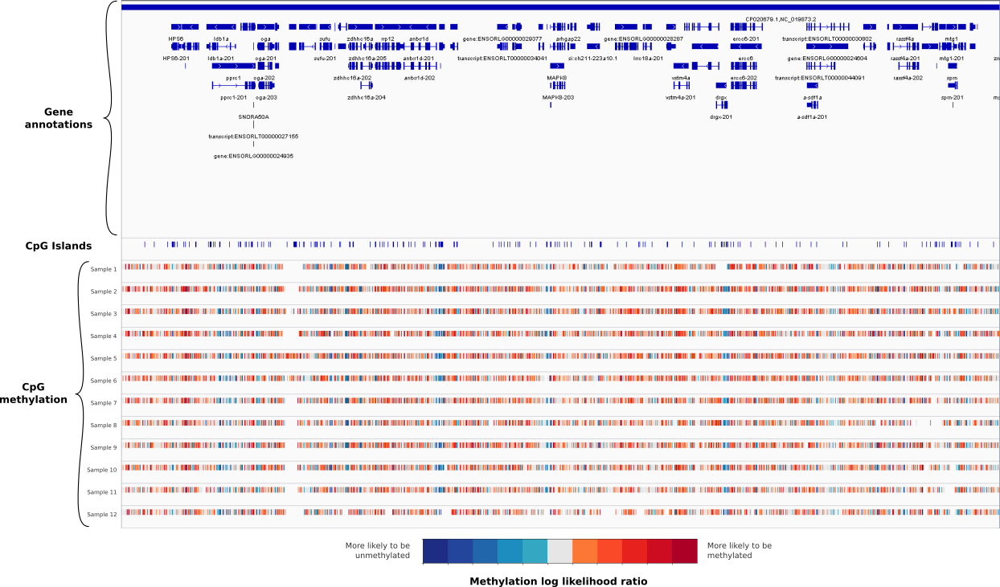

# CpG_Aggregate usage

**Calculate methylation frequency at genomic CpG sites from the output of `nanopolish call-methylation`**

## Example usage

* [Python API usage](https://a-slide.github.io/pycoMeth/CpG_Aggregate/API_usage/)
* [Shell CLI usage](https://a-slide.github.io/pycoMeth/CpG_Aggregate/CLI_usage/)

## Input files

### Nanopolish call-methylation output file

[`Nanopolish call-methylation`](https://nanopolish.readthedocs.io/en/latest/quickstart_call_methylation.html) tsv output file or a list of files or a regex matching several files.

### Reference FASTA file

FASTA reference file used for read alignment and Nanopolish. This file is required and used to sort the CpG sites by coordinates

## Output files

### Tabulated TSV file

This tabulated file contains the following fields:

* chromosome / start / end: Genomic coordinates of the CpG or cluster of CpGs if in less than 5 bases from each other.
* sequence: -5 to +5 sequence of the motif or group of motifs in case split_group was not selected.
* num_motifs: Number of motifs (CpG) found in the cluster.
* median_llr: Median of log likelihood ratios for all read mapped
* llr_list: List of raw llr values

### BED file

Standard genomic [BED9 format](https://genome.ucsc.edu/FAQ/FAQformat.html#format1) including an RGB color field. The score correspond to the median log likelihood ratio.
The file is already sorted by coordinates and can be rendered with a genome browser such as IGV

The sites are color-coded as follow:

- Median log likelihood ratio higher than 2 (Methylated):  Colorscale from orange (llr = 2) to deep red (llr >=6)
- Median log likelihood ratio lower than 2 (Unmethylated):  Colorscale from green (llr = -2) to deep blue (llr <= -6)
- Grey: Median log likelihood ration between -2 and 2 (ambiguous methylation status)

Here is an example of multiple methylation bed files rendered with IGV

