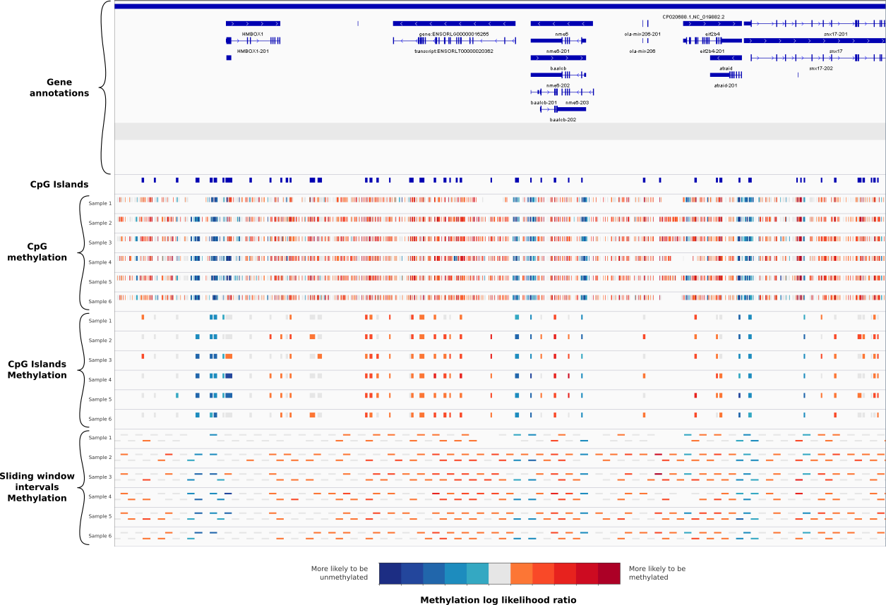

# Interval_Aggregate usage

**Bin the output of `pycoMeth CpG_Aggregate` in genomic intervals, using either an annotation file containing interval or a sliding window.**

## Example usage

* [Python API usage](https://a-slide.github.io/pycoMeth/Interval_Aggregate/API_usage/)
* [Shell CLI usage](https://a-slide.github.io/pycoMeth/Interval_Aggregate/CLI_usage/)

## Input files

### pycoMeth CpG_Aggregate output file

`pycoMeth CpG_Aggregate` **tsv** output file (not the bed output).

### Reference FASTA file

FASTA reference file used for read alignment and Nanopolish. This file is required and used to sort the CpG sites by coordinates

### BED file containing intervals

Optional **sorted** and BED file containing **non-overlapping** intervals to bin CpG data into. If this file is not provided, then the program use a sliding customizable window to bin data along the entire genome.

## Output files

### Tabulated TSV file

This tabulated file contains the following fields:

* chromosome / start / end : Genomic coordinates of the interval containing CpG sites
* num_motifs: Number of motifs (CpG) found in the interval.
* median_llr: Median of log likelihood ratios for each CpG cluster aggregated
* llr_list: List of median llr values for all CpG cluster aggregated

### BED file

Standard genomic [BED9 format](https://genome.ucsc.edu/FAQ/FAQformat.html#format1) including an RGB color field. The score correspond to the median log likelihood ratio.
The file is already sorted by coordinates and can be rendered with a genome browser such as IGV

The sites are color-coded as follow:

* Median log likelihood ratio higher than 2 (Methylated):  Colorscale from orange (llr = 2) to deep red (llr >=6)
* Median log likelihood ratio lower than 2 (Unmethylated):  Colorscale from green (llr = -2) to deep blue (llr <= -6)
* Grey: Median log likelihood ration between -2 and 2 (ambiguous methylation status)

Here is an example of multiple methylation bed files rendered with IGV

