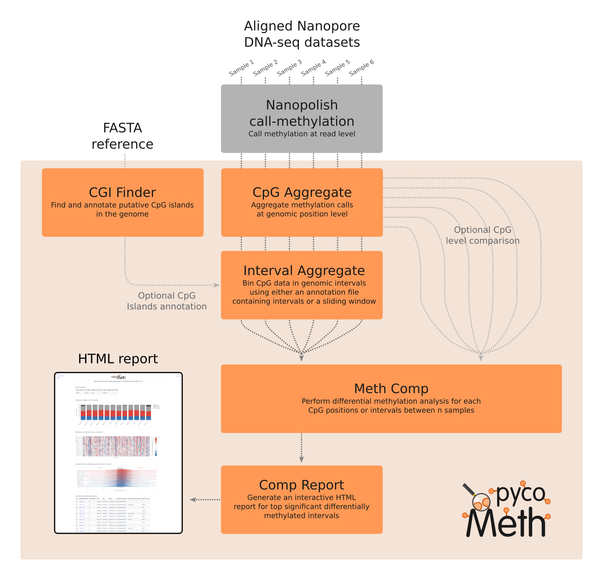

# Welcome to pycoMeth documentation

**Python package for nanopore DNA methylation analysis downstream to Nanopolish**

`pycoMeth` can be used for further analysis starting from the output files generated by [`Nanopolish call-methylation`](https://github.com/jts/nanopolish). The package contains tools to **summarize the methylation data at CpG or CpG island resolution** .`pycoMeth` also contains a simple method for **differential methylation analysis** across multiple samples.

The package contains the following modules:

* [CpG_Aggregate](CpG_Aggregate/usage): Aggregate the output of `nanopolish call-methylation` at genomic position level.
* [Interval_Aggregate](Interval_Aggregate/usage): Bin the output of `pycoMeth CpG_Aggregate` in genomic intervals, using either an annotation file or a sliding window.
* [Meth_Comp](Meth_Comp/usage): Compare Methylation level between several samples from either `pycoMeth CpG_Aggregate` or `pycoMeth Interval_Aggregate`.
* [CGI_Finder](CGI_Finder/usage): Find CpG islands in a fasta file by using a sliding window and merging overlapping windows satisfying the CpG island definition.

All the tools in `pycoMeth` can generate bed files compatible with many genomic viewers and more extensive tabulated reports allowing users to dig even deeper into the data.

---

## pycoMeth workflow

